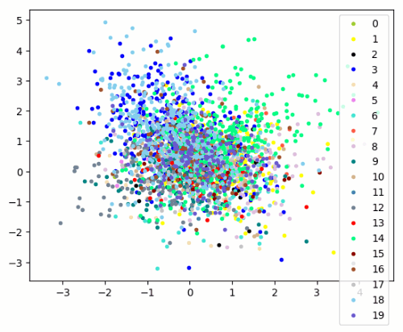
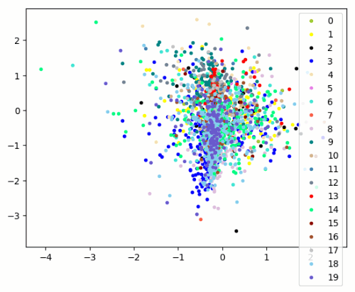

>2019.07.14    
>Currently, I have graduated from campus and doing another kind of job. So this project may not be updated again.

## Face_Pytorch
The implementation of  popular face recognition algorithms in pytorch framework, including arcface, cosface and sphereface and so on.

All codes are evaluated on Pytorch 0.4.0 with Python 3.6, Ubuntu 16.04.10, CUDA 9.1 and CUDNN 7.1. Partially evaluated on Pytorch 1.0.	

## Data Preparation
For CNN training, I use CASIA-WebFace and Cleaned MS-Celeb-1M, aligned by MTCNN with the size of 112x112.  For performance testing, I report the results on LFW, AgeDB-30, CFP-FP, MegaFace rank1 identification and verification.

For AgeDB-30 and CFP-FP, the aligned images and evaluation images pairs are restored from the mxnet binary file provided by [insightface](https://github.com/deepinsight/insightface), tools are available in this repository. You should install a mxnet-cpu first for the image parsing, just do ' **pip install mxnet** ' is ok.  
[LFW @ BaiduNetdisk](https://pan.baidu.com/s/1Rue4FBmGvdGMPkyy2ZqcdQ),   [AgeDB-30 @ BaiduNetdisk](https://pan.baidu.com/s/1sdw1lO5JfP6Ja99O7zprUg),   [CFP_FP @ BaiduNetdisk](https://pan.baidu.com/s/1gyFAAy427weUd2G-ozMgEg)

## Results
> MobileFaceNet: Struture described in MobileFaceNet  
> ResNet50: Original resnet structure  
> ResNet50-IR: CNN described in ArcFace paper  
> SEResNet50-IR: CNN described in ArcFace paper 
### Verification results on LFW, AgeDB-30 and CFP_FP  
Small Protocol: trained with CASIA-WebFace of data size: 453580/10575  
Large Protocol: trained with DeepGlint MS-Celeb-1M of data size: 3923399/86876

  Model Type    |   Loss    |   LFW   | AgeDB-30 | CFP-FP | Model Size | protocol
:--------------:|:---------:|:-------:|:--------:|:-------|:----------:|:--------:
MobileFaceNet   |  ArcFace  |  99.23  |   93.26  |  94.34 |    4MB     |  small
ResNet50-IR     |  ArcFace  |  99.42  |   94.45  |  95.34 |   170MB    |  small  
SEResNet50-IR   |  ArcFace  |  99.43  |   94.50  |  95.43 |   171MB    |  small
MobileFaceNet   |  ArcFace  |  99.58  |   96.57  |  92.90 |    4MB     |  large
ResNet50-IR     |  ArcFace  |  99.82  |   98.07  |  95.34 |   170MB    |  large
SEResNet50-IR   |  ArcFace  |  99.80  |   98.13  |  95.60 |   171MB    |  large
ResNet100-IR    |  ArcFace  |  99.83  |   98.28  |  96.41 |   256MB    |  large 

There exists an odd result fact that when training under small protocol, CFP-FP performances better than AgeDB-30, while when training with large scale dataset, CFP-FP performances worse than AgeDB-30.

### MegaFace rank 1 identifiaction accuracy and verfication@FPR=1e-6 results

  Model Type    |   Loss    | MF Acc. | MF Ver. | MF Acc.@R | MF Ver.@R | SIZE  | protocol
:--------------:|:---------:|:-------:|:-------:|:---------:|:---------:|:-----:|:-------:
MobileFaceNet   |  ArcFace  |  69.10  |  84.23  |   81.15   |   85.86   |  4MB  |  small
ResNet50-IR     |  ArcFace  |  74.31  |  88.23  |   87.44   |   89.56   | 170MB |  small
SEResNet50-IR   |  ArcFace  |  74.37  |  88.32  |   88.30   |   89.65   | 171MB |  small
MobileFaceNet   |  ArcFace  |  74.95  |  88.77  |   89.47   |   91.03   |  4MB  |  large
ResNet50-IR     |  ArcFace  |  79.61  |  96.02  |   96.58   |   96.78   | 170MB |  large
SEResNet50-IR   |  ArcFace  |  79.91  |  96.10  |   97.01   |   97.60   | 171MB |  large
ResNet100-IR    |  ArcFace  |  80.40  |  96.94  |   97.60   |   98.05   | 256MB |  large

## Usage 
1. Download the source code to your machine.
2. Prepare the train dataset and train list, test dataset and test verification pairs.
3. Set your own dataset path and any other parameters in train.py.
4. Run train.py file, test accuracy will print into log file during training process. 
---
5. Every evaluate file can work independently for the model test process. just set your own args in the file. 

## Visualization
Visdom support for loss and accuracy during training process.  

 
Softmax Loss vs Softmax_Center Loss. Left: softmax training set. Right: softmax + center loss training set. 

  
  

## References
[MuggleWang/CosFace_pytorch](https://github.com/MuggleWang/CosFace_pytorch)  
[Xiaoccer/MobileFaceNet_Pytorch](https://github.com/Xiaoccer/MobileFaceNet_Pytorch)  
[TreB1eN/InsightFace_Pytorch](https://github.com/TreB1eN/InsightFace_Pytorch)  
[deepinsight/insightface](https://github.com/deepinsight/insightface)  
[KaiyangZhou/pytorch-center-loss](https://github.com/KaiyangZhou/pytorch-center-loss)  
[tengshaofeng/ResidualAttentionNetwork-pytorch](https://github.com/tengshaofeng/ResidualAttentionNetwork-pytorch)

## Todo
1. Report the test results on DeepGlint Trillion Pairs Challenge.
2. Add C++ api for fast deployment with pytorch 1.0.
3. Train the ResNet100-based model.
